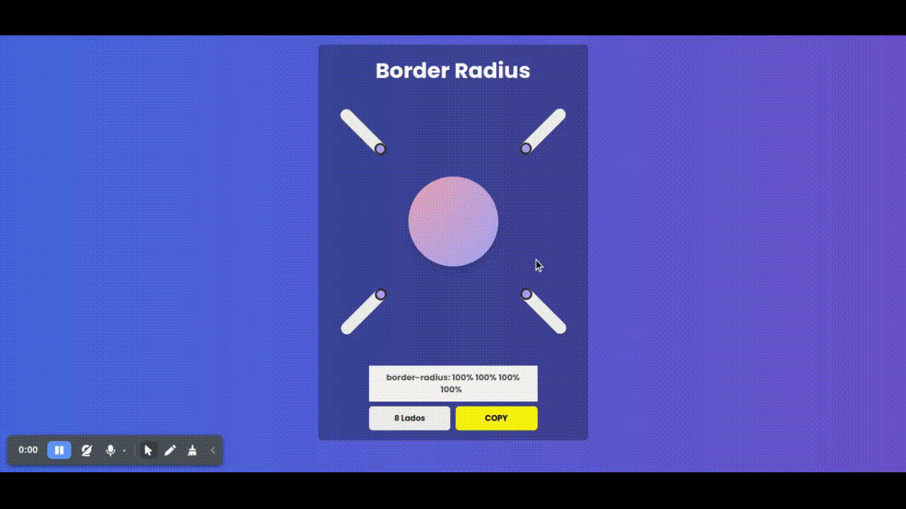

# Border Radius Generator



[Versão online aqui!!](https://brave-payne-33e73c.netlify.app/)

## Contexto

Esse projeto foi feito com a ideia de tornar visual o uso da propriedade border-radius do CSS, podendo controlar todos lados do objeto , assim facilitando a vida do programador front-end.

## Instalando  🚀
Clone o repositorio:

```sh
git clone https://github.com/MateusP21/border-radius-generator.git
```
Navegue até a pasta do projeto:

```sh
cd border-radius-generator
```
Instale as depêndencias:

```sh
yarn 
#ou 
npm install
```

Rode o projeto:
```sh
yarn start
#ou 
npm start
```
## Aprendizados 📖

Neste projeto pude aprender mais sobre:

* Context API
* Organização de componentes.
* Propriedade [border radius](https://developer.mozilla.org/pt-BR/docs/Web/CSS/border-radius)
* Estados do react
* Utilização de [Styled Components](https://styled-components.com/)

 Made with 💙 in Rio de Janeiro, Brasil.
